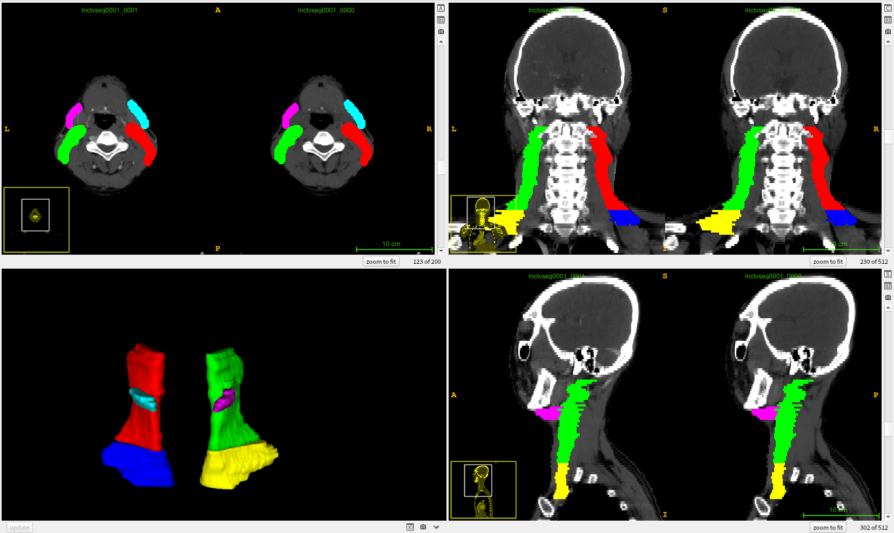

# [
 A multicenter dataset for lymph node clinical target volume delineation of nasopharyngeal carcinoma
](https://figshare.com/articles/dataset/LNCTVSeg-DataSet_zip/26793622?file=48684664)
* This work aims to use deep learning to delineate the lymph node clinical target volume in nasopharyngeal carcinoma (NPC) radiotherapy (RT).
* We will release the development set images and corresponding labels (with anonymization and de-identification of the face of patients), consisting of 440 computed tomography (CT) images from 262 patients with different imaging modalities, disease stages and treatment strategies.
* We have provided an example from the development cohort dataset, the details are as follows:

|Abbreviation|label index|LN levels included|Clinical significance in NPC RT|
|---|---|---|---|
|R_II+III+Va|	1	|Right levels II, III, and Va|	Right upper neck|
|L_II+III+Va|	2	|Left levels II,III, and Va	|Left upper neck|
|R_IV+Vb|	3	|Right levels IV and Vb|	Right lower neck|
|L_IV+Vb|	4	|Left levels IV and Vb	|Left lower neck|
|R_Ib|	5	|Right level Ib	|Right submandibular area|
|L_Ib|	6	|Left level Ib	|Left submandibular area|

Fig. 1. An example in the dataset.

## Acknowledgment and Statement
* Further details about this work will be disclosed upon publication.
* If you have any inquiries or are interested in collaborating on this topic, please do not hesitate to reach out to [Xiangde Luo](https://luoxd1996.github.io).
